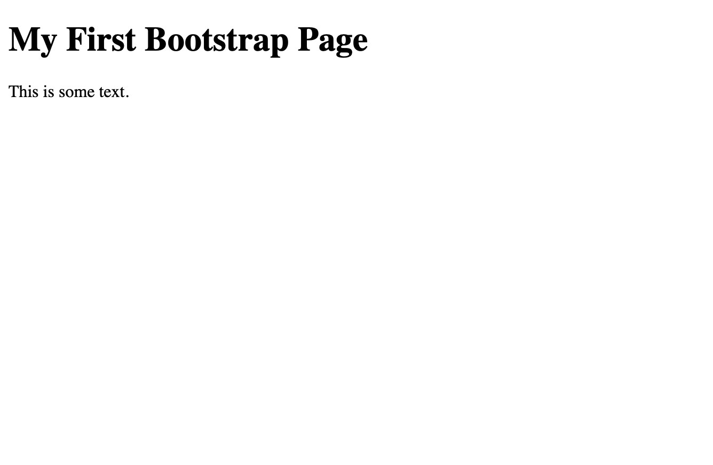
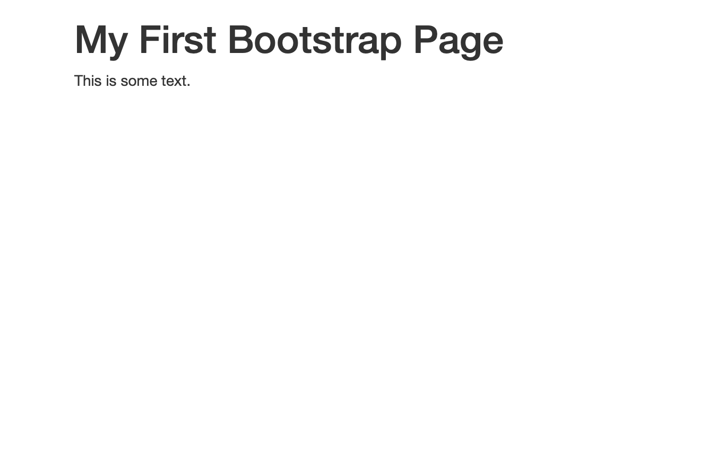
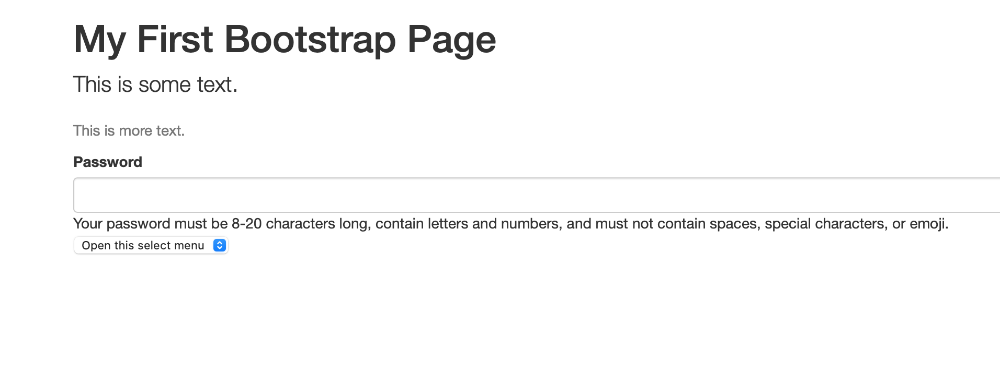

# How To Use Bootstrap to Create Responsive and Dynamic Web Pages


When designing web pages in HTML, the default styling and look of your content is often somewhat uninspiring. HTML is great for creating and managing content layout on a page, but without any extra tools, pages tend to look a bit bland. This is where tools like CSS and JavaScript come in, allowing creators and designers to make web pages not only more beautiful and appealing to the eye, but also dynamic and responsive to user input. While these tools are incredibly powerful and necessary for any web developer, there are times when it becomes too time consuming to write CSS styling for all of the elements on a basic webpage. This is where [Bootstrap](getbootstrap.com) comes in.  

Bootstrap is a free to use, simple, front-end framework for more streamlined web development. It allows web developers and content creators to use HTML and CSS based design templates to quickly add structure and style to their websites. A single Bootstrap tag can be applied to an entire page, which will automatically structure all of the existing elements to follow a certain CSS style. Bootstrap also includes the ability to utilize JavaScript plugins.  

The great thing about Bootstrap is the incredible ease of use. It you allows you to focus on the **content** of your website, while letting the bootstrap tags work on making everything look pretty. Using Bootstrap is as complex or as simple as the user desires it be. Adding a simple Bootstrap theme is as easy as copying a simple line of code into your `<head>`, which can quickly spice up some otherwise dull HTML. On the other hand, complex elements can be built and configured using Bootstrap's extensive [library](https://getbootstrap.com/docs/5.0/getting-started/introduction/) of tools. This is all to say that Bootstrap enables both the inexperienced and expert developer create more visually pleasing web pages. 

Bootstrap's power lies under the surface, and there are many elements of it that make it easier to develop a **responsive web page**. Designing responsive web pages is about making your content dynamic and flexible, so that it can be viewed on all sorts of devices and still function properly, from desktops to iPhones. In our modern world of mobile devices, it is imperative that every website be built to function on both conventional web browsers and mobile phones with ease. To this end, Bootstrap is designed using a mobile-first strategy. This means that it will optimize your website to look good and work properly on a mobile device first, and then scale up all of the components to fit into a desktop web browser when needed, rather than doing it the other way around. This ensures that all of your web content will automatically look great on a smartphone, which is where a lot of the content on the internet is primarily viewed. 

## How To Get Started

So, we've covered the basics of what Bootstrap is and what it can do for your code, but how is it actually used? Read on to find out.  

### 1. Write Some Basic HTML

To get started, we'll obviously need a web page to work with! If you don't have an HTML project that you currently want to apply Bootstrap to, start with a simple page, such as this:  

```HTML
<!DOCTYPE html>
<html lang="en">
    <head>
        <title>Bootstrap Tutorial Sample Page</title>
    </head>
    
    <body>
        <h1> Welcome to Bootstrap </h1>
    </body>
    
</html>
```

### 2. Get Bootstrap  

There are two way that Bootstrap can be utilized. The first, and simplest way to utilize Bootstrap is to include Bootstrap in your HTML using a **CDN**, or Content Delivery Network. This automatically and instantly retrieves all of the necessary Bootstrap components when a user loads your web-page. This method is recommended because many users will have already visited a Bootstrap powered website at some point, and thus the Bootstrap file will already be in their browser cache, making loading times particularly quick. Alternatively, you can [download](https://getbootstrap.com/docs/5.0/getting-started/download/) the Bootstrap source code and source it directly, if internet dependency is a concern. In this tutorial, we will be focusing on the first method, as it is best for most scenarios.  

To include Bootstrap in your HTML, simply paste the following link into the `<head>` of your HTML. Using MaxCDN will give you access to Bootstrap's CSS and JavaScript:  

```HTML
<!-- Latest compiled and minified CSS -->
<link rel="stylesheet" href="https://maxcdn.bootstrapcdn.com/bootstrap/3.4.1/css/bootstrap.min.css">

<!-- jQuery library -->
<script src="https://ajax.googleapis.com/ajax/libs/jquery/3.5.1/jquery.min.js"></script>

<!-- Latest compiled JavaScript -->
<script src="https://maxcdn.bootstrapcdn.com/bootstrap/3.4.1/js/bootstrap.min.js"></script>
```

And just like that, your web page has started to utilize the magic of Bootstrap!

> **Note:** Bootstrap's CSS and JavaScript properties require use of the HTML5 doctype to work properly. Be sure to include the HTML5 doctype, the lang attribute, and the correct character set at the beginning of your document to ensure proper execution: 
```HTML
<!DOCTYPE html>
<html lang="en">
  <head>
    <meta charset="utf-8"> 
  </head>
</html>
```

  
Our plain old vanilla HTML. 


Look how much nicer it already looks with Bootstrap!

### 3. Get Your Page Formatted Correctly

In order for Bootstrap to look nice wherever it is viewed, there are some steps we must take to ensure that your code fits nicely in the screen that it is being viewed within. First, we want to ensure that your site has the proper mobile-first response, so include the following meta tags in your document to tell your page to fit properly into whatever screen it is being viewed in, and so that the page can be zoomed on mobile devices. 

```HTML
<meta name="viewport" content="width=device-width, initial-scale=1">
```

Next, we want to wrap all of our page content nicely into a **container**. This frames all of your content nicely into a certain area, so that your content isn't directly touching the edges of the screen or browser window. To do this, simply wrap all of your `<body>` code in a container `<div>` element:

```HTML
<div class="container">
  <h1>Welcome to Bootstrap</h1>
  <p>This is my website.</p> 
</div>
```

### 4. Get Some Basic Components Going

Now that we've gotten Bootstrap all loaded up, and our page is formatted correctly for our browser, it's time to see what Bootstrap can really do. In this tutorial, we'll quickly learn how to use a couple of the components to get comfortable with how the process works.   

- **Let's Make Some Fancy Text**

Using some basic classes, we can make our headers and paragraphs stand out from one another by utilizing different fonts and text sizing. Or rather, we'll let Bootstrap handle it for us. By adding to "lead" class to a paragraph, it will stand out from others as looking more important. Next, we'll add a second paragraph with the "text-muted" class, to make it look more like an afterthought. 

```HTML
<p class="lead">This is some text.</p> 
<p class="text-muted">This is more text.</p>
```
- **Let's Create a Basic Input Form**  

Forms are fundamental in HTML for gathering user input and executing code based on it. Bootstrap gives us some great options for creating nice looking forms that prompt users for the correct input type. Here's some code for creating a basic password input form. 

```HTML
<label for="inputPassword5" class="form-label">Password</label>
<input type="password" id="inputPassword5" class="form-control" aria-describedby="passwordHelpBlock">
<div id="passwordHelpBlock" class="form-text">
  Your password must be 8-20 characters long, contain letters and numbers, and must not contain spaces, special characters, or emoji.
</div>
```  
Bootstrap will automatically format the text input box to fit the page and look nice.   

While text input boxes are great, sometimes we need to create a form that gives users options to choose from. A "form-select" class gives users a drop down menu to choose from a preset number of options. 

```HTML
<select class="form-select" aria-label="Default select example">
  <option selected>Select a City</option>
  <option value="1">New York</option>
  <option value="2">Paris</option>
  <option value="3">Singapore</option>
</select>
```  
  
Here's a look at our HTML with both forms.  

> As mentioned previously, there are countless different Bootstrap components that can be utilized for virtually anything on your page. Head to Bootstrap's [library](https://getbootstrap.com/docs/5.0/getting-started/introduction/) to see them all and learn how to use them. 

## Learn More

As with any technology, there are countless great resources for learning more and becoming an expert. Below is a list of other web pages to check out to learn more about how you can use Bootstrap to super charge your web development. 

- https://getbootstrap.com : Head to Bootstrap's website to learn everything there is to know about the service. Some of the info here is tailored towards those who are familiar with web development, so it's best to read a get started guide (Like this one!) before jumping in. Here you can find all of the documentation for Bootstrap's different components. 
- https://websitesetup.org/bootstrap-tutorial-for-beginners/ : A great, more in depth resource for getting Bootstrap configured in your code. 
- https://www.w3schools.com/bootstrap/bootstrap_get_started.asp : A more comprehensive walkthrough of all of Bootstrap's biggest features including a set up guide. A good jumping off point from this guide.  
- https://careerfoundry.com/en/blog/web-development/what-is-bootstrap-a-beginners-guide/ : Still confused by what this all means? Head here for a more beginner friendly explanation of Bootstrap, in plain english. Great for the layman web creator!


